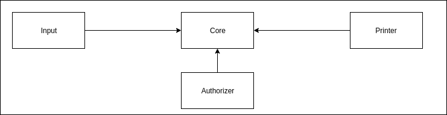
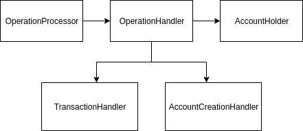
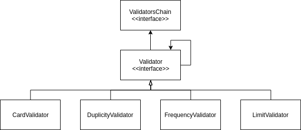

# Transaction Authorizer
Transaction Authorizer is a application to authorize a transaction of a given account following some predefined rules.

## Operations
The application supports two kinds of operations, being:
- Account Creation
- Transaction

An account can be created by providing the following json structure:

`{ "account": { "activeCard": true, "availableLimit": 100 }}`

A transaction can be performed with:

`{ "transaction": { "merchant": "Burger King", "amount": 20, "time": "2019-02-13T10:00:00.000Z" }}`

Note: Only one account can be created per execution

# Usage

To use the application you first need to build it by running:

`./mvnw package`

After that you can use a simple java -jar command, for example:

`java -jar target/transaction-authorizer-1.0-SNAPSHOT.jar operations`

# Tests

To run the tests you can simply run:

`./mnvw verify`

This will execute both unit and integration tests.

# Software Design

The application is divided in 4 big components which are core, authorizer, input and output.

The input and output packages are responsible for incoming and outgoing data from the application. Pretty straight forward.
In this current implementation we are using a simple file read as input and stdout as output.

The core package orchestrates the application's functionalities. Its main purpose is to process the available [Operations](#Operations).
The Operations are actually handled by the OperationHandler that is a interface in which its implementations are responsible for each
individual operation.

Basically it is a simple implementation of the Strategy pattern and the main idea here was to provide a extensible solution
by providing this interface to handle specific Operations in case there is a need for a new one, while maintaining the code understandable.

The main purpose of the application is to authorize a transaction, and basically the entire application is surrounded by the authorizer
module that contains most of the business logic. It is used by the TransactionHandler and it checks if a transaction is violating
any of the application's predefined rules.

The major concern about this module is its extensibility and maintainability. It should be easy to implement new transaction validations
in order to check for violations. It is implementation a Chain of Responsibility pattern that validates all our current validations.
To implement a new validation we should create a new class implement the [Handler class](/src/main/java/br/com/nubank/authorizer/validators/chain/Handler.java)
and add it to the Chain.

It is also really important to be keep it easy to change the current Chain, as a result, everything is this package is really loosed coupled
by a high use of the Interface Segregation principle from SOLID.

